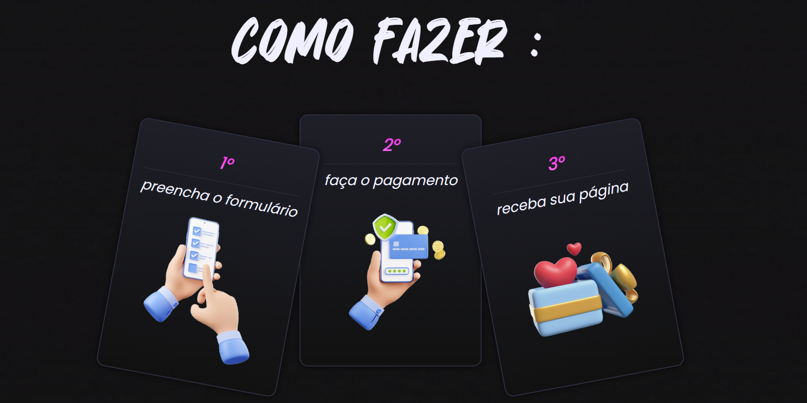
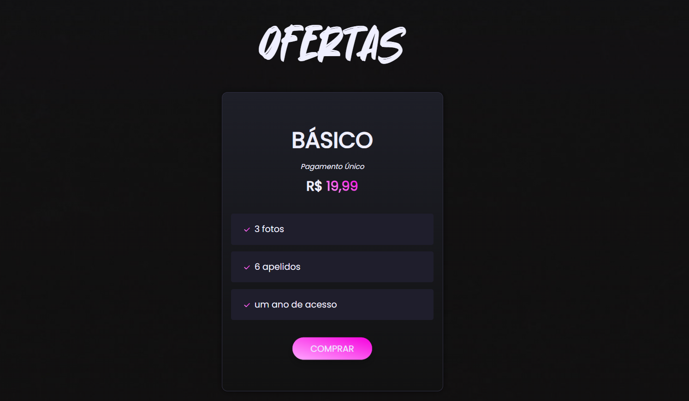
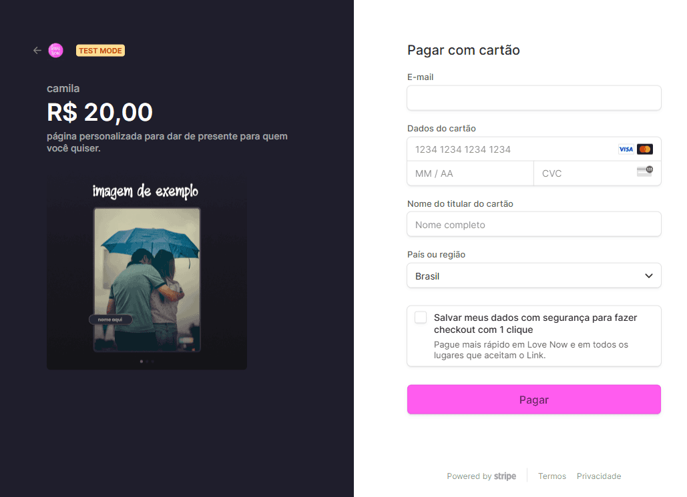

# Epic Games Store

<div align="center" >





</div>

<p>
  
  
  
</p>

## Tópicos

[Sobre a aplicação](#Propósito-e-Objetivo)

[Funcionalidades](#funcionalidades)

[Tecnologias e Ferramentas](#tecnologias-e-ferramentas)

[Instalação e uso](#instalação-e-uso)

<br>

## Propósito e Objetivo

Crair uma página customizada para a pessoa que você ama e entregar de presente.

<br>

## Funcionalidades

- [x] Criar uma página personalizada
- [x] Páginas dinâmicas com React js.
- [x] rotas iteráveis.

<br>

## Tecnologias e Ferramentas

As seguintes tecnologias foram utilizadas no desenvolvimento do projeto:

- [HTML](https://devdocs.io/html/)
- [CSS](https://devdocs.io/css/)
- [JavaScript](https://devdocs.io/javascript/)
- [React Js](https://devdocs.io/Reactjs/)
- [styled-components](https://devdocs.io/styled-components/)
- [Node js](https://devdocs.io/node)
- [React Hook-Form](https://devdocs.io/react-hook-form)
- [typescript](https://devdocs.io/react-hook-form)

<br>

## Design

O design foi feito do zero.

<br>

## Instalação e Uso

Para rodar a aplicação, você precisa instalar o [Node](https://nodejs.org/en/)

Siga os passos abaixo:

```bash
# Abra um terminal e copie este repositório com o comando
$ git clone https://github.com/felipeSilv4Dev/love-now.git
# ou use a opção de download.

# Instale as dependências
$ npm install

# Rode a aplicação
$ npm run dev
```

<br>

<strong>Site : ...</strong>

---

Feito com :red_heart: by [Felipe_Silva](https://github.com/felipeSilv4dev)

 <div align="start">
  <a href='http://www.linkedin.com/in/felipe-silva-1019ab271' target'_blank'>
  <a href="mailto:felipesantana18n@gmail.com" target='_blank'> </a>
</div>
